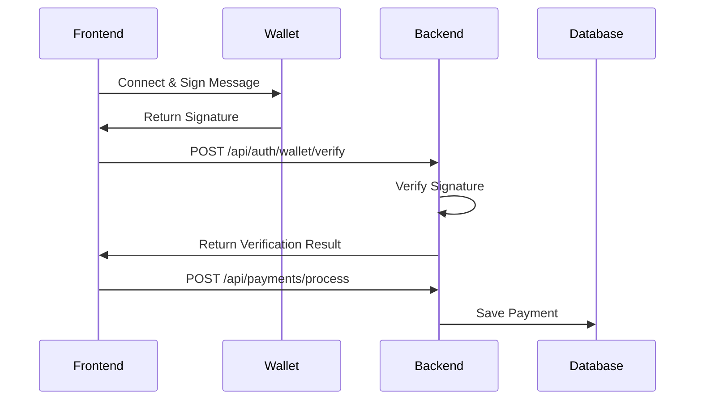

# Wallet Architecture Analysis & Recommendations

## Current Problems

### 1. Backend Wallet Service Issues

- ❌ Uses `@stacks/connect` (browser-only library) on Node.js server
- ❌ Tries to manage wallet connections server-side (impossible)
- ❌ Violates frontend/backend separation
- ❌ Cannot work in production deployment

### 2. Performance Issues

- 🐌 Backend trying to do frontend wallet operations
- 🐌 Unnecessary complexity in payment flow
- 🐌 Mixing client-side and server-side responsibilities

## Recommended Architecture

### Frontend Responsibilities

```typescript
// ✅ FRONTEND: /frontend/lib/services/wallet-service.ts
class WalletService {
  // Connect to wallet
  async connectWallet(): Promise<WalletConnectionResult>;

  // Sign messages/transactions
  async signMessage(message: string): Promise<WalletSignatureResult>;

  // Prepare authentication data for backend
  async prepareWalletAuthentication(): Promise<WalletAuthData>;

  // Submit payment data to backend API
  async submitPayment(paymentData: PaymentData): Promise<PaymentResult>;
}
```

### Backend Responsibilities

```typescript
// ✅ BACKEND: /backend/src/services/wallet-verification-service.ts
class WalletVerificationService {
  // Verify signatures sent from frontend
  async verifySignature(data: SignatureData): Promise<boolean>;

  // Validate payment authorization
  async validatePaymentAuth(authData: AuthData): Promise<boolean>;

  // Process verified payments
  async processPayment(payment: Payment): Promise<Result>;
}
```

## Optimal Flow

### 1. Wallet Connection & Payment

```
Frontend (Browser) → Wallet → Frontend → Backend API → Database
     ↓                ↓         ↓           ↓
  Connect          Sign      Prepare    Verify &
  Wallet          Message    Auth Data   Process
```

### 2. Payment Authorization



## What to Remove

### From Backend:

- ❌ `wallet-service.ts` (entire file)
- ❌ `@stacks/connect` dependency
- ❌ `@stacks/wallet-sdk` dependency
- ❌ Wallet connection logic
- ❌ Transaction signing logic

### Keep in Backend:

- ✅ `wallet-auth-service.ts` (but rename to `signature-verification-service.ts`)
- ✅ `@stacks/encryption` (for signature verification)
- ✅ Message validation
- ✅ Payment processing

## Performance Gains

### Before (Current - Broken)

```
Frontend → Backend → Wallet (❌ IMPOSSIBLE)
```

**Problems:**

- Cannot work (backend can't access browser wallet)
- Extra API calls
- Server resources wasted

### After (Recommended)

```
Frontend → Wallet → Frontend → Backend
```

**Benefits:**

- ✅ Actually works in production
- ✅ Faster (direct wallet interaction)
- ✅ Better UX (no server round-trips for wallet ops)
- ✅ Cleaner separation of concerns
- ✅ Easier to debug and maintain

## Implementation Plan

### Phase 1: Remove Backend Wallet Dependencies

1. Delete `/backend/src/services/wallet-service.ts`
2. Remove `@stacks/connect` from backend package.json
3. Update imports in payment-service.ts and other files

### Phase 2: Strengthen Frontend Wallet Service

1. Enhance `/frontend/lib/services/wallet-service.ts`
2. Add proper error handling
3. Implement payment preparation methods

### Phase 3: Backend API Refinement

1. Rename `wallet-auth-service.ts` → `signature-verification-service.ts`
2. Keep only verification logic
3. Update API endpoints to receive prepared data from frontend

### Phase 4: Integration

1. Update frontend to use new wallet service
2. Connect frontend to refined backend APIs
3. Test complete payment flow

## Final Architecture Benefits

- 🚀 **Performance**: Direct wallet interaction, no unnecessary API calls
- 🔒 **Security**: Signatures verified server-side, no wallet private keys on server
- 🏗️ **Maintainability**: Clear separation, easier debugging
- 📱 **Scalability**: Backend doesn't manage wallet state
- ✅ **Production Ready**: No browser dependencies on server
