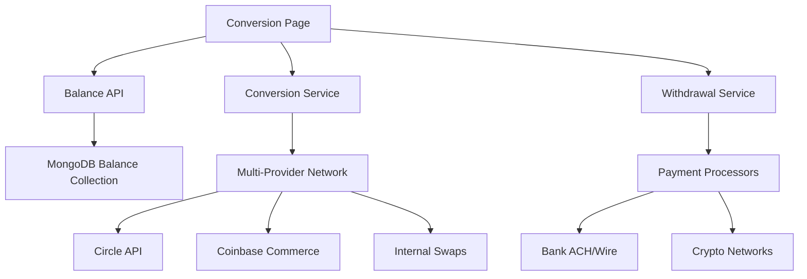

# Technical Implementation Guide - Balance & Conversion Dashboard

**Project**: sBTC Payment Gateway  
**Component**: Balance & Conversion Dashboard  
**Framework**: Next.js 14 + TypeScript + Tailwind CSS  
**Last Updated**: August 18, 2025

## Architecture Overview

The Balance & Conversion Dashboard is built as a modular, reusable component system that can be integrated into any Next.js application or adapted for other React frameworks.

### Component Structure

```
app/(dashboard)/conversion/
└── page.tsx                 # Main dashboard page

components/dashboard/conversion/
├── BalanceCard.tsx          # Individual currency balance display
├── ConversionWidget.tsx     # Currency conversion interface
├── TransactionHistory.tsx   # Transaction list with filtering
├── WithdrawalForm.tsx       # Withdrawal request form
└── ConversionSettings.tsx   # Configuration management
```

### Data Flow Architecture



## Core Components

### 1. BalanceCard Component

**Purpose**: Display individual currency balances with visual indicators

**Props Interface**:

```typescript
interface BalanceCardProps {
  balance: {
    currency: string;
    amount: number;
    usdValue: number;
    change24h: number;
    available: number;
    pending: number;
    reserved: number;
  };
  hideAmount?: boolean;
}
```

**Key Features**:

- Dynamic currency icons and colors
- 24-hour change indicators with trend arrows
- Balance breakdown (available/pending/reserved)
- Privacy toggle for amount hiding
- Responsive hover animations

**Usage**:

```tsx
<BalanceCard
  balance={{
    currency: 'sBTC',
    amount: 0.00125,
    usdValue: 56.25,
    change24h: 2.5,
    available: 0.00125,
    pending: 0,
    reserved: 0,
  }}
  hideAmount={false}
/>
```

### 2. ConversionWidget Component

**Purpose**: Handle currency conversions with real-time rate calculations

**Props Interface**:

```typescript
interface ConversionWidgetProps {
  balances: Balance[];
  onConversionComplete: (transaction: ConversionTransaction) => void;
}
```

**Key Features**:

- Dynamic conversion pair validation
- Real-time rate fetching with provider selection
- Fee calculation and breakdown display
- Slippage tolerance configuration
- Progress indicators and error handling

**Implementation Highlights**:

```typescript
// Rate fetching with provider selection
const fetchConversionRate = async () => {
  const provider = getBestProvider(fromCurrency, toCurrency);
  const rate = await conversionService.getRate(fromCurrency, toCurrency, provider);
  setConversionRate(rate);
};

// Supported pairs validation
const getAvailableToCurrencies = (from: string) => {
  return supportedPairs.filter((pair) => pair.from === from).map((pair) => pair.to);
};
```

### 3.TransactionHistory Component

**Purpose**: Display transaction history with filtering and status tracking

**Features**:

- Real-time status updates
- Transaction type icons and colors
- Copy-to-clipboard for transaction IDs
- Time-based formatting with `date-fns`
- Expandable details view

**Data Structure**:

```typescript
interface ConversionTransaction {
  id: string;
  type: 'conversion' | 'deposit' | 'withdrawal' | 'receive';
  fromCurrency?: string;
  toCurrency?: string;
  fromAmount?: number;
  toAmount?: number;
  amount: number;
  currency: string;
  status: 'pending' | 'processing' | 'completed' | 'failed';
  timestamp: Date;
  txId?: string;
  provider?: string;
  fees: {
    conversion?: number;
    network?: number;
    total: number;
  };
}
```

### 4. WithdrawalForm Component

**Purpose**: Handle withdrawal requests to various destinations

**Withdrawal Methods**:

```typescript
interface WithdrawalMethod {
  id: string;
  type: 'bank' | 'crypto' | 'card';
  name: string;
  details: string;
  currency: string;
  fees: { fixed: number; percentage: number };
  minAmount: number;
  maxAmount: number;
  estimatedTime: string;
}
```

**Key Features**:

- Dynamic method filtering by currency
- Fee calculation with fixed + percentage components
- Address validation for crypto withdrawals
- Form validation and error handling
- Progress tracking and status updates

### 5. ConversionSettings Component

**Purpose**: Configure conversion preferences and wallet addresses

**Settings Categories**:

- Auto-conversion configuration
- Payment method preferences
- Wallet address management
- Bank account details
- Notification settings
- Advanced parameters (slippage, providers)

## Integration Guide

### 1. Install Dependencies

```bash
npm install framer-motion lucide-react date-fns
npm install @radix-ui/react-select @radix-ui/react-switch
npm install recharts # for future chart integration
```

### 2. Copy Component Files

```bash
# Copy the conversion dashboard components
cp -r components/dashboard/conversion/ your-project/components/dashboard/
cp app/(dashboard)/conversion/page.tsx your-project/app/conversion/
```

### 3. Update Imports

Ensure your project has these UI components:

```typescript
// Required UI components
import { Card, CardContent, CardDescription, CardHeader, CardTitle } from '@/components/ui/card';
import { Button } from '@/components/ui/button';
import { Input } from '@/components/ui/input';
import { Label } from '@/components/ui/label';
import { Badge } from '@/components/ui/badge';
import { Alert, AlertDescription } from '@/components/ui/alert';
import {
  Select,
  SelectContent,
  SelectItem,
  SelectTrigger,
  SelectValue,
} from '@/components/ui/select';
import { Switch } from '@/components/ui/switch';
import { Textarea } from '@/components/ui/textarea';
```

### 4. Backend API Integration

Create these API endpoints:

```typescript
// app/api/v1/balance/route.ts
export async function GET(request: NextRequest) {
  // Return merchant balance data
}

// app/api/v1/conversions/route.ts
export async function POST(request: NextRequest) {
  // Handle conversion requests
}

// app/api/v1/conversions/rates/route.ts
export async function GET(request: NextRequest) {
  // Return current conversion rates
}

// app/api/v1/withdrawals/route.ts
export async function POST(request: NextRequest) {
  // Handle withdrawal requests
}
```

### 5. State Management

Integrate with your preferred state management solution:

```typescript
// Using Zustand
import { create } from 'zustand';

interface ConversionStore {
  balances: Balance[];
  transactions: Transaction[];
  isLoading: boolean;
  refreshBalances: () => Promise<void>;
  createConversion: (data: ConversionData) => Promise<void>;
  createWithdrawal: (data: WithdrawalData) => Promise<void>;
}

export const useConversionStore = create<ConversionStore>((set, get) => ({
  // Implementation
}));
```

## Customization Options

### 1. Theme Customization

```typescript
// Custom color schemes for different currencies
const currencyThemes = {
  sBTC: {
    primary: '#f97316', // orange-500
    background: 'bg-orange-50 dark:bg-orange-900/20',
    border: 'border-orange-200 dark:border-orange-800',
    text: 'text-orange-600 dark:text-orange-400',
  },
  USD: {
    primary: '#22c55e', // green-500
    background: 'bg-green-50 dark:bg-green-900/20',
    border: 'border-green-200 dark:border-green-800',
    text: 'text-green-600 dark:text-green-400',
  },
  // Add more currencies...
};
```

### 2. Provider Configuration

```typescript
// Configure conversion providers
const conversionProviders = {
  circle: {
    name: 'Circle API',
    description: 'Institutional grade USD/USDC',
    fees: { base: 0.003, network: 0.1 },
    supportedPairs: ['USD/USDC', 'USDC/USD', 'BTC/USDC'],
    estimatedTime: 'Instant - 15 minutes',
  },
  coinbase: {
    name: 'Coinbase Commerce',
    description: 'Broad crypto support',
    fees: { base: 0.01, network: 0.5 },
    supportedPairs: ['BTC/USDC', 'ETH/USDC', 'BTC/USD'],
    estimatedTime: '10-30 minutes',
  },
  internal: {
    name: 'Internal Swaps',
    description: 'sBTC and Stacks DeFi',
    fees: { base: 0.005, network: 0.01 },
    supportedPairs: ['STX/sBTC', 'sBTC/STX', 'BTC/sBTC'],
    estimatedTime: '5-15 minutes',
  },
};
```

### 3. Feature Flags

```typescript
// Control feature availability
const featureFlags = {
  enableAutoConversion: true,
  enableMultiCurrencyPayments: true,
  enableCryptoWithdrawals: true,
  enableBankWithdrawals: true,
  enableRealTimeRates: true,
  enableWebhookNotifications: true,
  enableAdvancedSettings: true,
};
```

## Performance Optimizations

### 1. Rate Caching

```typescript
// Implement rate caching to reduce API calls
const rateCache = new Map<string, { rate: number; timestamp: number }>();
const CACHE_DURATION = 60 * 1000; // 1 minute

const getCachedRate = (pair: string) => {
  const cached = rateCache.get(pair);
  if (cached && Date.now() - cached.timestamp < CACHE_DURATION) {
    return cached.rate;
  }
  return null;
};
```

### 2. Component Memoization

```typescript
// Memoize expensive components
const BalanceCard = React.memo(({ balance, hideAmount }: BalanceCardProps) => {
  // Component implementation
});

const ConversionWidget = React.memo(({ balances, onConversionComplete }: ConversionWidgetProps) => {
  // Component implementation
});
```

### 3. Virtual Scrolling for Transaction History

```typescript
// For large transaction lists
import { FixedSizeList as List } from 'react-window';

const VirtualTransactionList = ({ transactions }: { transactions: Transaction[] }) => (
  <List height={400} itemCount={transactions.length} itemSize={80} itemData={transactions}>
    {({ index, style, data }) => (
      <div style={style}>
        <TransactionItem transaction={data[index]} />
      </div>
    )}
  </List>
);
```

## Testing Strategy

### 1. Unit Tests

```typescript
// BalanceCard.test.tsx
import { render, screen } from '@testing-library/react';
import { BalanceCard } from './BalanceCard';

describe('BalanceCard', () => {
  const mockBalance = {
    currency: 'sBTC',
    amount: 0.001,
    usdValue: 45,
    change24h: 2.5,
    available: 0.001,
    pending: 0,
    reserved: 0,
  };

  it('displays currency and amount correctly', () => {
    render(<BalanceCard balance={mockBalance} />);
    expect(screen.getByText('sBTC')).toBeInTheDocument();
    expect(screen.getByText('0.00100000 sBTC')).toBeInTheDocument();
  });

  it('hides amount when hideAmount is true', () => {
    render(<BalanceCard balance={mockBalance} hideAmount={true} />);
    expect(screen.getByText('••••••')).toBeInTheDocument();
  });
});
```

### 2. Integration Tests

```typescript
// ConversionWidget.test.tsx
import { render, screen, fireEvent, waitFor } from '@testing-library/react';
import { ConversionWidget } from './ConversionWidget';

describe('ConversionWidget', () => {
  it('calculates conversion correctly', async () => {
    const mockBalances = [
      /* test data */
    ];
    const onComplete = jest.fn();

    render(<ConversionWidget balances={mockBalances} onConversionComplete={onComplete} />);

    // Fill out form
    fireEvent.change(screen.getByPlaceholderText('0.00'), { target: { value: '100' } });

    // Wait for rate calculation
    await waitFor(() => {
      expect(screen.getByText(/Rate:/)).toBeInTheDocument();
    });

    // Submit conversion
    fireEvent.click(screen.getByText('Convert'));

    await waitFor(() => {
      expect(onComplete).toHaveBeenCalled();
    });
  });
});
```

### 3. E2E Tests

```typescript
// conversion.e2e.ts
import { test, expect } from '@playwright/test';

test('complete conversion flow', async ({ page }) => {
  await page.goto('/dashboard/conversion');

  // Navigate to convert tab
  await page.click('text=Convert');

  // Fill conversion form
  await page.selectOption('[data-testid="from-currency"]', 'STX');
  await page.selectOption('[data-testid="to-currency"]', 'sBTC');
  await page.fill('[data-testid="amount-input"]', '100');

  // Wait for rate calculation
  await page.waitForSelector('[data-testid="conversion-rate"]');

  // Submit conversion
  await page.click('[data-testid="convert-button"]');

  // Verify success
  await expect(page.locator('[data-testid="success-message"]')).toBeVisible();
});
```

## Deployment Considerations

### 1. Environment Variables

```env
# .env.local
NEXT_PUBLIC_SBTC_API_URL=https://api.sbtcpay.com
SBTC_API_SECRET=your-secret-key
CIRCLE_API_KEY=your-circle-key
COINBASE_COMMERCE_KEY=your-coinbase-key
WEBHOOK_SECRET=your-webhook-secret
```

### 2. Database Schema

```sql
-- Balance tracking table
CREATE TABLE merchant_balances (
  id SERIAL PRIMARY KEY,
  merchant_id VARCHAR(255) NOT NULL,
  currency VARCHAR(10) NOT NULL,
  amount DECIMAL(20,8) NOT NULL,
  available DECIMAL(20,8) NOT NULL,
  pending DECIMAL(20,8) DEFAULT 0,
  reserved DECIMAL(20,8) DEFAULT 0,
  updated_at TIMESTAMP DEFAULT CURRENT_TIMESTAMP,
  UNIQUE(merchant_id, currency)
);

-- Conversion history
CREATE TABLE conversions (
  id SERIAL PRIMARY KEY,
  merchant_id VARCHAR(255) NOT NULL,
  from_currency VARCHAR(10) NOT NULL,
  to_currency VARCHAR(10) NOT NULL,
  from_amount DECIMAL(20,8) NOT NULL,
  to_amount DECIMAL(20,8) NOT NULL,
  rate DECIMAL(20,8) NOT NULL,
  fees JSONB,
  provider VARCHAR(50),
  status VARCHAR(20),
  tx_id VARCHAR(255),
  created_at TIMESTAMP DEFAULT CURRENT_TIMESTAMP
);
```

### 3. Monitoring and Alerting

```typescript
// Add monitoring for critical operations
const monitorConversion = (conversionData: any) => {
  // Log conversion attempt
  console.log('Conversion initiated:', conversionData);

  // Send metrics to monitoring service
  metrics.increment('conversions.initiated', {
    from_currency: conversionData.fromCurrency,
    to_currency: conversionData.toCurrency,
    provider: conversionData.provider,
  });

  // Set up alerts for failures
  if (conversionData.status === 'failed') {
    alerts.send('Conversion failed', conversionData);
  }
};
```

This technical implementation guide provides developers with everything needed to integrate and customize the Balance & Conversion Dashboard for their specific use cases while maintaining the core functionality and user experience.
